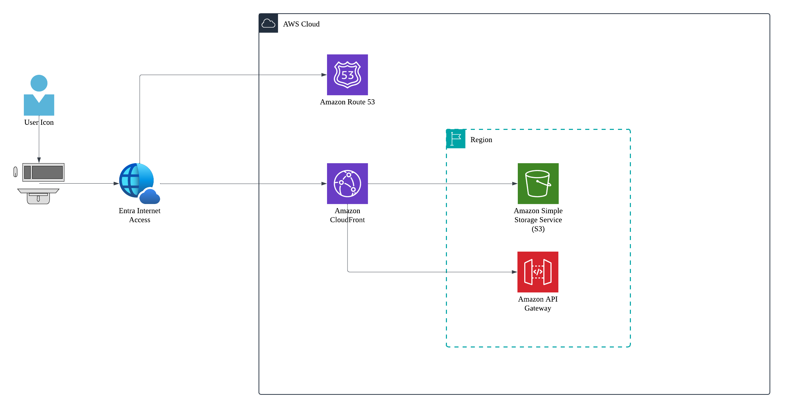
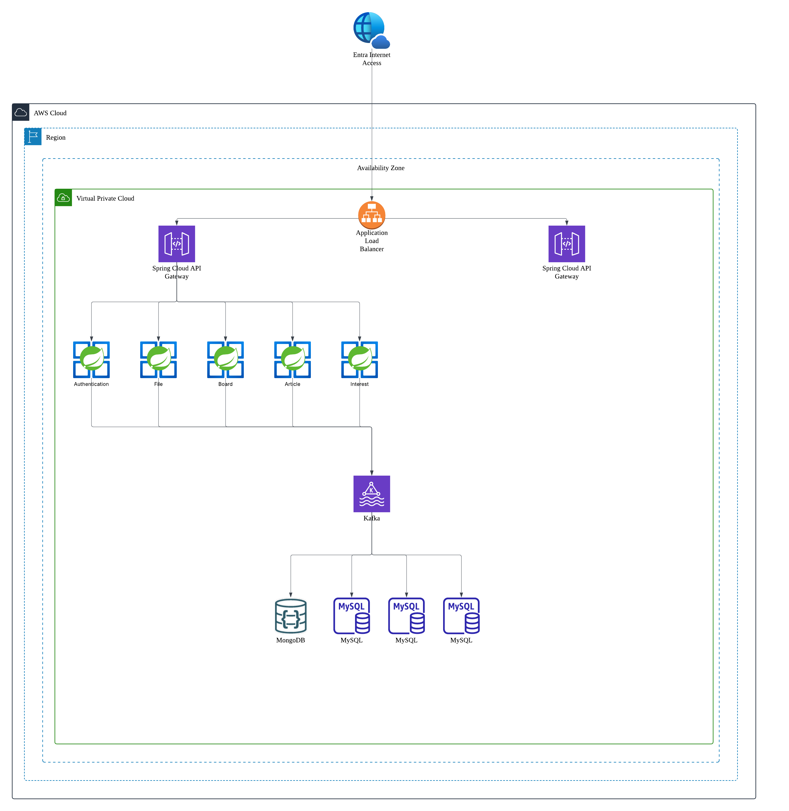
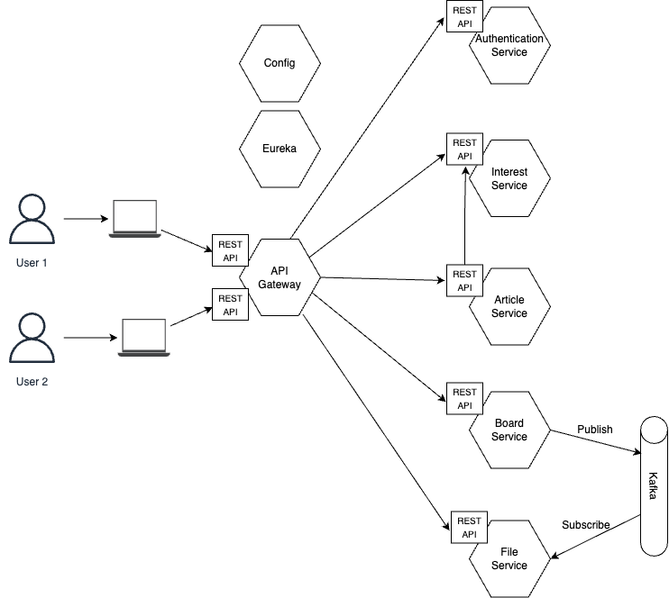

# Micro 3

## 프로젝트 개요

- 기존 프로젝트를 MSA 환경에 맞게 구성하며, CI/CD를 구축하여 개발부터 배포까지의 사이클 타임을 단축하고자 합니다.
- 기존 프로젝트의 성능을 측정하여 취약점을 찾아내고, 이를 보완하고자 합니다. 하단 `성능 향상` 목차를 참고해주세요.

## 서비스 실행 방법

### 로컬

- 실행 방법
    
    아래의 설명을 참고하여 환경 변수를 **`.env`** 파일을 루트 디렉토리(/Kitcha)에 생성한 후, docker-compose.yaml 파일이 있는 디렉토리에서 아래의 명령어를 실행합니다.
    
    ```bash
    docker compose up -d
    ```
    
- 환경변수
    - MySQL 관련
        
        
        | 항목  | 설명 |
        | --- | --- |
        | MYSQL_ROOT_PASSWORD | MySQL의 루트 사용자 비밀번호 |
        | MYSQL_DATABASE | 생성할 기본 데이터베이스 이름 |
        | MYSQL_USER | MySQL 사용자 이름 |
        | MYSQL_PASSWORD | 위 MySQL_USER의 비밀번호 |
    - MongoDB 관련
        
        
        | 항목 | 설명 |
        | --- | --- |
        | MONGO_DATABASE | MongoDB 데이터베이스 이름 |
        | MONGO_USER | MongoDB 사용자 이름 |
        | MONGO_PASSWORD | MongoDB 사용자 비밀번호 |
    - 서버 관련
        
        
        | 항목 | 설명 |
        | --- | --- |
        | VITE_API_BASE_URL | 백엔드 서버 Base 주소 |
        | FRONTEND_SERVER | 프론트엔드 서버 주소 |
    - 인증/보안 관련
        
        
        | 항목 | 설명 |
        | --- | --- |
        | TOKEN_SECRET | JWT 토큰 비밀 키 |
        | TOKEN_EXPIRATION_TIME | 토큰 만료 시간 |
    - 외부 API 관련
        
        
        | 항목 | 설명 |
        | --- | --- |
        | NAVER_CLIENT_ID | 네이버 뉴스 Open API Client ID |
        | NAVER_CLIENT_SECRET | 네이버 뉴스 Open API Client Secret |
        | OPENAI_API_KEY | Open API Key  |
    - AWS 관련
        
        
        | 항목 | 설명 |
        | --- | --- |
        | AWS_ACCESS_KEY_ID | AWS Access Key ID |
        | AWS_SECRET_ACCESS_KEY | AWS Secret Access Key  |
        | AWS_S3_BUCKET | AWS S3 Bucket 이름 (게시판에서 생성한 PDF 저장용)  |
    - 테스트 계정 관련
        
        
        | 항목 | 설명 |
        | --- | --- |
        | TEST_USER_PASSWORD | 테스트용 사용자 계정의 비밀번호  |
        | TEST_ADMIN_PASSWORD | 테스트용 관리자 계정의 비밀번호  |

### 클라우드 아키텍처





## MSA

### 서비스 구성 및 서비스 간 호출 흐름



## API 명세서

https://docs.google.com/spreadsheets/d/1iaG9gvqz7Z1Od52EG6-oADBhh2SM0AVqktZF8eIVcoo/edit?usp=sharing

## 성능 측정

### 리팩토링 이전

- 게시글 생성 요청
    
    
    | **Label** | **# Samples** | **Average** | **Min** | **Max** | **Std. Dev.** | **Error %** | **Throughput** | **Received KB/sec** | **Sent KB/sec** | **Avg. Bytes** |
    | --- | --- | --- | --- | --- | --- | --- | --- | --- | --- | --- |
    | **Board POST** | 5880 | 12 | 4 | 451 | 17.72 | 89.082% | 9.82013 | 3.86 | 5.56 | 402.2 |
    | **TOTAL** | 5880 | 12 | 4 | 451 | 17.72 | 89.082% | 9.82013 | 3.86 | 5.56 | 402.2 |
- 

## 향후 개선 방향

- 로깅
각 서비스가 분산되어 있고 독립적이기 때문에 로그를 체계적으로 남기는 것이 중요합니다. ELK나 Zipkin 등을 활용하여 서비스 간 호출, 에러 등을 중앙에서 수집 및 분석할 수 있도록 하고자 합니다.
- 서킷 브레이커/타임아웃 구성 
MSA 특성 상 여러 서비스 간 네트워크 호출로 동작하는데, 어떤 서비스가 느려지거나 실패하면 전체 시스템이 전염처럼 퍼지며 무너질 수 있습니다. 이에 서킷 브레이커를 도입하여 장애 감지와 응답 제한시간을 설정하고자 합니다.
- Public, Private Subnet 분리 
실제 서비스 로직을 가진 이너 서비스들이 Private Subnet에서 실행되도록 하여 보안을 강화하고자 합니다.
